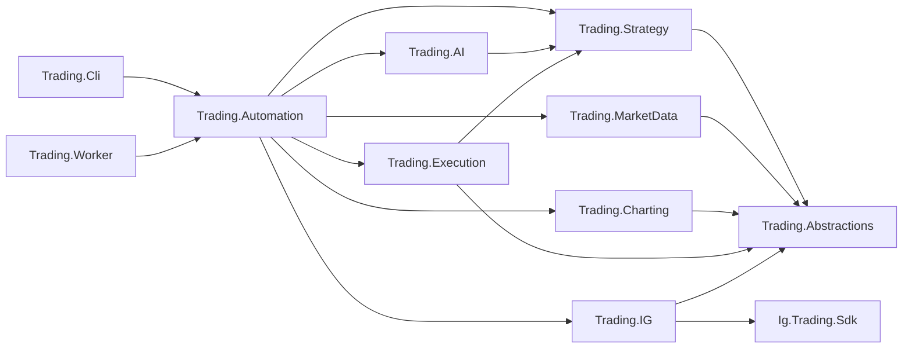

# AI Trader IG Architecture

This document is the canonical overview of the current AI Trader IG architecture. It is written for developers who are new to the repository and for maintainers deciding where a change belongs.

It describes what exists in the current checkout, the boundaries that must remain stable, the main runtime flows, the state and evidence model, and the intended extension seams. Files under `specs/plans/` contain planning and roadmap context that may span completed and future phases; they are not evidence by themselves that a feature is implemented.

## 1. Reading map

Use the repository documentation in this order:

1. Start with the root [README](../README.md) for local setup, configuration, and the shortest path to running the CLI.
2. Read this document for system structure, dependency direction, runtime flows, state ownership, and extension guidance.
3. Use the [CLI reference](cli-use.md) for command syntax and operational workflows.
4. Read [worker memory diagnostics](worker-memory-diagnostics.md) before changing worker limits, GC settings, or restart behavior.
5. Read [the SDK README](../src/Ig.Trading.Sdk/README.md) only when working on the standalone IG REST SDK.
6. Consult `specs/plans/` for roadmap context after understanding the current implementation.

The most important architectural rule is:

> AI proposes. Strategy decides. Execution controls broker mutations. The broker adapter translates.

No layer should quietly take over another layer's responsibility.

## 2. System at a glance

The solution is a .NET trading system with two production outer hosts and one local-only diagnostics tool:

- `Trading.Cli` runs explicit manual, diagnostic, and automation commands.
- `Trading.Worker` hosts scheduled automation, market-data services, health reporting, and TickerQ jobs.
- `Trading.Worker.Diagnostics` runs the worker diagnostics module with synthetic allocations in a local Linux cgroup; it never composes IG, AI, or trading automation services.

Both hosts compose the same application services. The worker uses a minimal local ASP.NET host to run TickerQ; it is not a public trading API.



The diagram shows the primary architectural direction. The exact direct project references are listed below.

## 3. Projects and dependency direction

Dependencies should point inward toward broker-neutral contracts and policy. Outer projects may compose inner projects; inner projects must not reference hosts, schedulers, the IG adapter, or transport DTOs.

| Project | Current responsibility | Direct repository dependencies |
| --- | --- | --- |
| `Trading.Abstractions` | Broker-neutral gateway contracts, price models, order models, errors, and value objects. | None |
| `Ig.Trading.Sdk` | Standalone IG REST and streaming SDK: Refit contracts, IG DTOs, authentication, session tokens, and endpoint behavior. | None |
| `Trading.Strategy` | Broker-neutral daily-planning policy, deterministic intraday decisions, shadow/demo eligibility, and execution-ready intent. | `Trading.Abstractions` |
| `Trading.Charting` | Broker-neutral `PriceSeries` rendering through `IPriceChartRenderer`. ScottPlot stays internal here. | `Trading.Abstractions` |
| `Trading.MarketData` | Local-first price retrieval, SQLite persistence, stream ingestion, recovery, gap analysis, historical backfill, and GCS snapshot synchronization. | `Trading.Abstractions` |
| `Trading.AI` | Typed AI requests, prompt resources, prompt/schema provenance, OpenAI execution, strict response schemas, mapping, and prompt observability. | `Trading.Strategy` |
| `Trading.Execution` | Durable operation reservation, submission leasing, idempotency, deal references, attempt history, reconciliation state, and broker-mutation coordination. | `Trading.Abstractions`, `Trading.Strategy` |
| `Trading.IG` | Thin adapter from broker-neutral contracts to the IG SDK, including error translation and IG stream integration. | `Trading.Abstractions`, `Ig.Trading.Sdk`, `Trading.MarketData` |
| `Trading.Automation` | Application orchestration across planning, preparation, AI analysis, deterministic decisions, evidence persistence, execution handoff, scheduling, and worker health. | `Trading.AI`, `Trading.Charting`, `Trading.Execution`, `Trading.IG`, `Trading.MarketData`, `Trading.Strategy` |
| `Trading.Cli` | Spectre.Console composition root and command rendering. | `Trading.Abstractions`, `Trading.Automation`, `Trading.Charting`, `Trading.Execution`, `Trading.IG`, `Trading.MarketData` |
| `Trading.Worker` | Minimal executable that starts `TradingWorkerApplication`. | `Trading.Automation`, `Trading.IG` |
| `Trading.Worker.Diagnostics` (`tools/`) | Local-only synthetic memory lab that composes the production diagnostics module without broker or AI services. | `Trading.Automation` |
| `Trading.Infrastructure` | Pulumi definitions for the GCP worker VM, service account, and backup bucket. It is deployment tooling, not a runtime domain layer. | None |

### Boundary guardrails

- `Trading.Abstractions` must not contain IG terminology, HTTP concerns, configuration, or persistence.
- `Ig.Trading.Sdk` must remain usable without the rest of the solution.
- `Trading.IG` maps and translates; it must not become a second SDK or a durable journal.
- `Trading.Strategy` owns deterministic policy, not prompt text, scheduling, files, or broker calls.
- `Trading.AI` owns prompt construction and provider interaction, but it does not authorize a trade.
- `Trading.Execution` owns broker-mutation safety and idempotency, not candidate scoring.
- `Trading.Automation` sequences components; it must not hide strategy rules inside orchestration branches.
- `Trading.Cli` and `Trading.Worker` are shells. Complex workflows belong in application services.

## 4. Composition roots and application modes

### CLI

`Trading.Cli/Program.cs` uses `Host.CreateApplicationBuilder`, loads configuration, and registers:

- `AddIgTradingGateway`
- `AddTradingAutomation`
- `AddTradingCharting`
- `AddTradingCli`

`TradingCliApplication` builds the Spectre.Console command tree. Commands resolve services and render results; they should not implement trading policy.

Operational commands and diagnostic commands are deliberately grouped separately. Temporary endpoint probes, prompt experiments, audit tooling, and market-data repair commands belong under explicit diagnostic branches rather than the main trading surface.

### Worker

`Trading.Worker` delegates to `TradingWorkerApplication` in `Trading.Automation`. That application:

- creates the local host;
- configures Serilog;
- configures TickerQ in the automation timezone;
- registers the same automation, IG, and charting services as the CLI;
- keeps daily-planning and intraday schedules disabled during the production market-data-only phase;
- hosts market-data collection, recovery, snapshot, mirror, and health services.

The production systemd unit explicitly sets `Automation__Enabled=false`,
`Automation__IntradayOpportunities__Enabled=false`, and
`Automation__Execution__Mode=Disabled`. Worker health reporting and its existing
Slack alert path remain enabled.

### Configuration

The hosts use the normal .NET configuration pipeline, then add the git-ignored `appsettings.local.json`, tracked-market configuration, and user secrets. Environment variables use double underscores, for example `IG__ApiKey`.

The main configuration owners are:

| Section | Owner | Purpose |
| --- | --- | --- |
| `IG` | `Ig.Trading.Sdk` / `Trading.IG` | Endpoint, credentials, account, and IG client behavior |
| `AI:OpenAI` | `Trading.AI` | OpenAI connection settings |
| `AI:DailyBriefing` | `Trading.AI` | Daily models, timezone, and tracked markets |
| `AI:IntradayOpportunityReview` | `Trading.AI` | Intraday model and prompt execution settings |
| `AI:Prompts` | `Trading.AI` | Prompt observability root |
| `Automation` | `Trading.Automation` | schedules, timezone, intraday preparation, and execution mode |
| `MarketData` | `Trading.MarketData` | SQLite, collection, recovery, backfill, and cloud snapshots |
| `WorkerHealth` / `WorkerDiagnostics` / `Alerting` | `Trading.Automation` | health evidence, bounded memory forensics, optional containment, and operational alerts |

Secrets must live in environment variables, user secrets, or ignored local configuration. Tracked configuration must never contain live credentials.

## 5. Main runtime flows

### 5.1 Daily planning

The daily flow establishes strategic context and the active watchlist.

1. A CLI command or `DailyBriefingTickerJob` invokes `DailyBriefingPlanService`.
2. `DailyBriefingPlanService` calls the narrow `ITradingDayPlanner` contract.
3. `TradingDayPlanner` supplies a `DailyPlanningPolicy` and calls `IDailyBriefingComposer`.
4. The `Trading.AI` composer runs the research prompt and the structured plan-conversion prompt.
5. The response is mapped into a broker-neutral `TradingDayPlan`.
6. `TradingDayPlanner` validates the policy-sized shortlist and saves a new `TradingDayRecord`.
7. `InMemoryTradingDayStore` holds the plan and the IDs of deterministic decisions already handled that day.

`DailyPlanEnsureService` lazily creates a missing plan before a full intraday run. It uses a per-date lock so concurrent scans do not create duplicate plans. The preparation-only command intentionally does not auto-create a plan.

### 5.2 Intraday decision pipeline

`IntradayOpportunityScanService` is intentionally a small sequencer:

1. **Gate:** `IntradayOpportunityScanGate` prevents overlapping scans in the process.
2. **Ensure:** a full run ensures the current trading-day plan exists.
3. **Prepare:** `IIntradayOpportunityPreparationService` loads the plan and fresh price data through `IIntradayPriceSeriesSource`.
4. **Render evidence:** the current implementation renders one OHLC chart with compressed gaps per watched market through `IPriceChartRenderer`. The data model supports multiple evidence items.
5. **Persist preparation:** `IIntradayOpportunityPreparationStore` writes a typed, write-once preparation document, rendered request, and evidence artifacts.
6. **Verify and analyze:** `IIntradayOpportunityAnalysisService` validates the preparation before `IIntradayOpportunityReviewer` calls OpenAI.
7. **Map:** `Trading.AI` maps the strict structured response into a broker-neutral `IntradayOpportunityBatch`.
8. **Decide:** `IIntradayDecisionService` applies deterministic policy independently of the AI's confidence.
9. **Reserve:** if a candidate becomes an execution-ready intent, `Trading.Execution` reserves its durable execution boundary.
10. **Audit:** `DecisionAuditWriter` creates the immutable decision-time audit and the coordinator attaches its path to the execution record.
11. **Optional demo:** in `Demo` mode, `DemoCanaryExecutionService` may submit the tightly gated demo order and writes a separate execution sidecar.

The CLI exposes preparation and submission separately. This is deliberate: developers can inspect or archive the exact request and evidence before making a provider call.

### 5.3 What is verified before an AI call

Prepared submission fails closed when any of these checks fail:

- preparation schema version;
- prompt identifier;
- prompt version and SHA-256;
- response-schema version and SHA-256;
- re-rendered request text;
- request-text SHA-256;
- duplicate or missing evidence IDs;
- evidence file SHA-256;
- evidence-to-market ownership;
- attachment label and media-type consistency.

Changing a prompt, schema, evidence artifact, or prepared request therefore requires regeneration rather than silently replaying mismatched inputs.

### 5.4 Deterministic decision and execution modes

The AI produces assessments and candidates. `IntradayCandidateDecisionService` recalculates and validates:

- active-watchlist membership;
- supported instrument and entry method;
- trading date;
- setup expiry;
- quote freshness;
- entry, stop, and target geometry;
- reward/risk;
- spread relative to risk;
- movement away from the proposed entry;
- opportunity score;
- high-impact event windows;
- duplicate decisions.

The current modes are:

| Mode | Behavior |
| --- | --- |
| `Disabled` | Default. Candidates are recorded but cannot produce an approved execution intent. |
| `Shadow` | May create and reserve an execution-ready intent. No broker order is submitted. |
| `Demo` | May promote one approved intent into the separately armed, allowlisted IG demo canary path. |
| `Live` | Present in the enum for domain completeness but explicitly rejected by the current policy validation. Automated live trading is not implemented. |

Demo execution additionally checks the approved demo base URL, account, instrument allowlist, kill switch, daily trade limit, unresolved exposure, broker minimum size, and stop/limit protection.

### 5.5 Broker mutation flow

Manual and automated writes use the same durable execution boundary:

1. The caller supplies or derives a stable operation ID.
2. `ExecutionBoundaryService` reserves the operation and broker-safe deal reference.
3. `ExecutionSubmissionService` acquires a submission lease.
4. The service calls the broker-neutral `ITradingGateway`.
5. `Trading.IG` maps the request and translates errors.
6. `Ig.Trading.Sdk` performs the HTTP operation and manages IG session headers.
7. `Trading.Execution` records the attempt and final or uncertain state.

An uncertain submitted operation must be reconciled; it must not be retried blindly. Read-only broker calls may go directly through `ITradingGateway` because they do not require mutation idempotency.

### 5.6 Market-data flow

Market data follows a local-first stream-and-fill model:

1. The IG streaming adapter emits broker-neutral updates through `IMarketDataStreamClient`.
2. `MarketDataStreamBatchIngestor` places callbacks into a bounded channel.
3. Forming-candle updates may be coalesced; final candles must be persisted or fail loudly.
4. `SqliteMarketDataStore` stores instruments, final/forming bars, health, coverage, and market-session evidence.
5. `MarketDataService` reads locally and may request bounded REST backfill when data is missing and backfill is enabled.
6. `PriceBarAggregator` derives coarser resolutions from canonical bars.
7. The production publisher can upload validated SQLite snapshots to GCS.
8. Mirror mode downloads, validates, and imports final cloud bars while preserving local health and transient state. Automatic IG REST backfill is disabled in mirror mode.

Strategy and AI code consume broker-neutral price data through these services; they do not call IG price endpoints directly.

### 5.7 Worker memory and deployment safety

The production worker is capable of running market-data collection, SQLite snapshot/recovery, daily automation, and fifteen-minute intraday chart preparation in one process on a 1 GiB GCP `e2-micro`. During the current collection-only phase, the systemd configuration disables the daily/intraday schedules and execution while retaining market-data persistence, health, and Slack alerting. This means a chart allocation failure and unrelated guest-wide pressure remain distinct failure classes: systemd's service cgroup can constrain the worker, but it cannot prevent unrelated cron or other host processes from exhausting the VM. systemd applies `MemoryHigh=400M`, `MemoryMax=480M`, `Restart=on-failure`, and a best-effort `ExecStopPost` evidence hook. The worker also keeps:

- the existing one-minute `worker-status.json` health/Slack path;
- a one-second in-memory cgroup sentry;
- a five-second bounded JSONL forensic trace with process/PSS, GC generation, SQLite allocator, full cgroup, host PSI/process-census, stream, operation, snapshot, and recovery counters; and
- healthy-only single-flight closed-artifact upload with a 30-second timeout, pressure cancellation, and 30-day GCS prefix retention.

The diagnostics module does not retain broker or prompt payloads. Its proactive cgroup containment policy is currently disabled in production; it must be enabled only after local and production evidence meets the documented acceptance gate. The full design, local lab, GC experiment policy, and incident workflow are in [worker-memory-diagnostics.md](worker-memory-diagnostics.md).

## 6. State, persistence, and ownership

| State or artifact | Owner | Default location | Lifetime and rule |
| --- | --- | --- | --- |
| Trading-day plan and handled decision IDs | `Trading.Strategy` | In memory | Volatile. A restart loses it; a full scan lazily recreates today's plan. |
| Market bars, coverage, health, and session evidence | `Trading.MarketData` | `Logs/MarketData/ig-market-data.sqlite` | Durable SQLite with WAL. |
| Execution operations and attempts | `Trading.Execution` | `Logs/Execution/execution-boundary.sqlite` | Durable source of truth for mutation idempotency and uncertain outcomes. |
| Prompt and response observability | `Trading.AI` | `Logs/Observability/<date>/` | Run-scoped request, envelope, attachment, and extracted-response evidence. |
| Intraday preparation and evidence manifest | `Trading.Automation` | `Logs/Observability/<date>/` | Write-once. Includes schema/profile versions, prompt contract, hashes, time windows, and recipe provenance. |
| Decision audit | `Trading.Automation` | `*-decision-audit.json` | Immutable decision-time record. |
| Paper evaluation | `Trading.Automation` | `*-decision-evaluation-*.json` | Append-only sidecar containing the source audit path and SHA-256. |
| Demo-canary result | `Trading.Automation` | `*-demo-execution-*.json` | Append-only sidecar containing the source audit path and SHA-256. |
| Cloud mirror state and snapshots | `Trading.MarketData` | Configured under `Logs/MarketData/cloud-mirror/` | Local synchronization state; validated before import. |
| Worker health | `Trading.Automation` | `worker-status.json` and optionally GCS | Operational evidence, not trading policy. Includes process/GC state, stream metrics, and the latest bounded chart/evidence operation metrics. |
| Worker memory trace and exit evidence | `Trading.Automation` / systemd | `/var/lib/ai-trader/diagnostics` and optional GCS | Bounded operational forensics only. Active traces are recovered on the next start; successful prior-run uploads are deleted locally. |

Historical audit JSON containing the older embedded outcome fields can still be loaded. New evaluations and demo results must use sidecars and must not rewrite source audits.

## 7. Prompt and evidence contracts

Prompt behavior is source-controlled and versioned:

- `PromptRegistry` assigns each prompt an ID and explicit version.
- Markdown prompt resources live under `Trading.AI/Prompts`.
- Structured prompts also name a response-schema resource and version.
- The prompt and schema SHA-256 values form `PromptContractProvenance`.
- Typed request models cross from Automation into AI; formatted prompt strings do not leak back into Strategy.
- Provider responses must pass the strict schema before mapping.

The evidence model is deliberately broader than the current chart implementation. Each `PreparedDecisionEvidence` records:

- evidence kind;
- label and media type;
- optional instrument ownership;
- observation window and as-of time;
- recipe ID and version;
- artifact path;
- SHA-256;
- whether the artifact is attached to the prompt.

This makes multiple charts, structured market-data extracts, research documents, and non-visual evidence composable without changing the deterministic strategy contract.

## 8. Extension guide

### Add or change a deterministic strategy rule

1. Start in `Trading.Strategy`, normally around `IntradayCandidateDecisionService` or a small policy type.
2. Write behavior-oriented Strategy tests first.
3. Keep the rule broker-neutral and independent of prompt wording.
4. Add the effective value to the rules/context snapshot when it affects reconstructability.
5. Expose configuration through Automation only after the strategy behavior is explicit.

Do not implement deterministic rejection or approval logic inside a prompt, CLI command, or IG adapter.

### Add an AI prompt or prompt variant

1. Add or update the typed request/response model in `Trading.AI`.
2. Add the embedded Markdown prompt and strict response schema.
3. Register it in `PromptRegistry` with explicit versions.
4. Add rendering, mapping, and provenance tests.
5. Route to it from `Trading.Automation`.
6. Keep the output compatible with the broker-neutral Strategy input, or introduce a deliberate mapping boundary.

Prompt text belongs in AI resources, not interpolated throughout orchestration code.

### Add a chart or another evidence recipe

1. Keep reusable rendering mechanics in `Trading.Charting`.
2. Use `IIntradayPriceSeriesSource` for price inputs.
3. Emit one or more `PreparedDecisionEvidence` values during preparation.
4. Give every recipe a stable ID and increment its version when semantics change.
5. Record accurate windows and as-of timestamps.
6. Add persistence and tamper-detection tests.

The current default is one `price-chart-ohlc-compressed` recipe. There is no generic recipe framework yet; extract one when a second real recipe makes the shared contract clear.

### Add market-specific experts

The current implementation has one intraday reviewer and one default preparation profile. A future expert router should:

- live in `Trading.Automation`, where application-level profile selection belongs;
- choose using broker-neutral market metadata or explicit configuration;
- keep expert prompt definitions and schemas in `Trading.AI`;
- record the selected preparation profile and prompt contract in evidence;
- normalize expert output into the shared `IntradayOpportunityBatch`;
- leave deterministic approval in `Trading.Strategy`.

Do not create commodity, FX, or crypto subclasses in Strategy merely to choose prompt wording. Prefer composable profiles and routing once there are at least two concrete expert implementations.

### Add another broker

1. Keep `Trading.Abstractions` broker-neutral.
2. Implement `ITradingGateway` in a separate adapter project.
3. Isolate that broker's SDK/transport models.
4. Reuse `Trading.Execution` for durable mutations.
5. Register the adapter only at the host composition root.

### Add a CLI or scheduled command

1. Put reusable sequencing in `Trading.Automation`.
2. Put deterministic policy in `Trading.Strategy`.
3. Keep the CLI command or TickerQ job to parameter parsing, invocation, cancellation, and rendering.
4. Add command tests only for parsing/rendering behavior; test the workflow at its owning service.

## 9. Testing architecture

Tests mirror production ownership:

| Test project | Primary scope |
| --- | --- |
| `Trading.Abstractions.Tests` | Domain contract and model behavior |
| `Ig.Trading.Sdk.Tests` | IG transport/authentication behavior |
| `Trading.IG.Tests` | Adapter mapping, error translation, and opt-in IG demo integration |
| `Trading.Strategy.Tests` | Daily policy and deterministic decisions |
| `Trading.AI.Tests` | Prompt rendering, schema/provenance, mapping, and provider-boundary behavior |
| `Trading.MarketData.Tests` | persistence, aggregation, ingestion, recovery, gaps, and snapshots |
| `Trading.Charting.Tests` | rendering behavior |
| `Trading.Execution.Tests` | reservations, leasing, deduplication, and reconciliation |
| `Trading.Automation.Tests` | application sequencing, evidence integrity, audit immutability, evaluation, and demo safety |
| `Trading.Cli.Tests` | CLI parsing and rendering |

Run the fast default suite with:

```powershell
dotnet test Trading.slnx
```

IG demo tests are opt-in and must remain clearly separated from the default suite. Use fakes at network, filesystem, clock, market-data, and provider boundaries; avoid mocking internal implementation details.

For architecture changes, test in small increments:

1. the owning inner policy or contract;
2. the application service that composes it;
3. artifact compatibility and failure behavior;
4. the full solution.

## 10. Failure and safety posture

The system should fail closed when uncertainty could create a trade or corrupt evidence:

- execution mode defaults to `Disabled`;
- automated `Live` mode is rejected;
- demo execution requires explicit arming and an unengaged kill switch;
- unknown or changed prompt/evidence contracts require regeneration;
- write-once evidence collisions fail instead of overwriting;
- incomplete audit market data remains `DataInsufficient` unless stored session evidence supports a closed-market classification;
- uncertain broker submissions remain durable and require reconciliation;
- secrets and session tokens must never appear in logs or tracked files.

Expected no-op outcomes should remain distinguishable from failures. For example, an audit evaluation with no matching decision records is valid zero work, while a corrupt audit artifact is an error.

## 11. Current limits versus roadmap

A newcomer should not infer future functionality from names or plans. The current implementation has these deliberate limits:

- one default daily-planning policy with a three-market shortlist;
- one intraday AI reviewer;
- one default preparation profile;
- one price-chart evidence recipe per prepared market;
- volatile trading-day state;
- deterministic `Disabled`, `Shadow`, and tightly gated `Demo` automation only;
- no automated live trading;
- no market-expert router;
- no generic strategy/plugin framework;
- IG as the only broker adapter.

The evidence and orchestration boundaries are designed so that additional recipes, prompt variants, experts, and deterministic strategies can be added incrementally. They are extension seams, not claims that those implementations already exist.

## 12. Architectural red flags

Reject or redesign changes that introduce these patterns:

- **Leaky transport DTOs:** an `Ig.Trading.Sdk.Models` type reaches Strategy, Automation contracts, or the CLI.
- **Fat adapter:** `Trading.IG` starts owning HTTP serialization, prompt logic, durable state, or decision policy.
- **Gateway journaling:** idempotency or execution SQLite writes move out of `Trading.Execution`.
- **AI authorization:** an LLM confidence value bypasses deterministic Strategy checks.
- **Prompt strings in orchestration:** prompt formatting is duplicated outside `Trading.AI`.
- **Mutable evidence:** evaluation or demo code rewrites a source decision audit or preparation artifact.
- **CLI business logic:** a command handler contains workflow branching that belongs in Automation.
- **Direct price fetches from Strategy:** a strategy rule calls IG or bypasses `Trading.MarketData`.
- **Naked broker errors:** SDK exceptions escape the adapter without broker-neutral context.
- **Speculative frameworks:** generic strategy, expert, or evidence frameworks appear before multiple concrete implementations justify them.
- **Secret commits:** credentials, API keys, tokens, or real account identifiers enter tracked source or configuration.

## 13. Suggested code-reading tour

For a first pass through the implementation:

1. Read [`ITradingGateway.cs`](../src/Trading.Abstractions/ITradingGateway.cs) and the core Abstractions models.
2. Read [`ITradingDayPlanner.cs`](../src/Trading.Strategy/DayPlanning/ITradingDayPlanner.cs) and [`IIntradayDecisionService.cs`](../src/Trading.Strategy/OpportunityReview/IIntradayDecisionService.cs).
3. Read [`IntradayCandidateDecisionService.cs`](../src/Trading.Strategy/OpportunityReview/IntradayCandidateDecisionService.cs) to understand deterministic authority.
4. Read [`PromptRegistry.cs`](../src/Trading.AI/Prompts/PromptRegistry.cs) and [`IntradayOpportunityReviewer.cs`](../src/Trading.AI/DailyBriefing/IntradayOpportunityReviewer.cs).
5. Read [`IntradayOpportunityScanService.cs`](../src/Trading.Automation/Execution/IntradayOpportunityScanService.cs), then the adjacent preparation, analysis, and coordinator services.
6. Read [`ExecutionBoundaryService.cs`](../src/Trading.Execution/ExecutionBoundaryService.cs) and [`ExecutionSubmissionService.cs`](../src/Trading.Execution/ExecutionSubmissionService.cs).
7. Read the [`Trading.IG`](../src/Trading.IG) adapter before [`Ig.Trading.Sdk`](../src/Ig.Trading.Sdk) to see the broker-neutral mapping boundary.
8. Read [`MarketDataService.cs`](../src/Trading.MarketData/MarketDataService.cs) and [`MarketDataStreamBatchIngestor.cs`](../src/Trading.MarketData/MarketDataStreamBatchIngestor.cs).
9. Use the corresponding test project alongside each production project; the tests are part of the behavioral documentation.

When a change does not have an obvious owner after this tour, stop and make the ownership decision explicit before adding another cross-project dependency.
